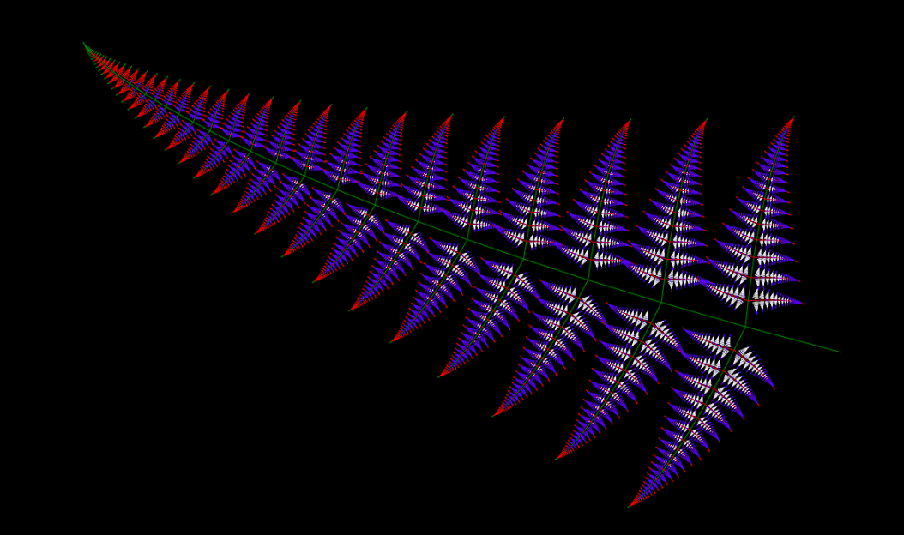
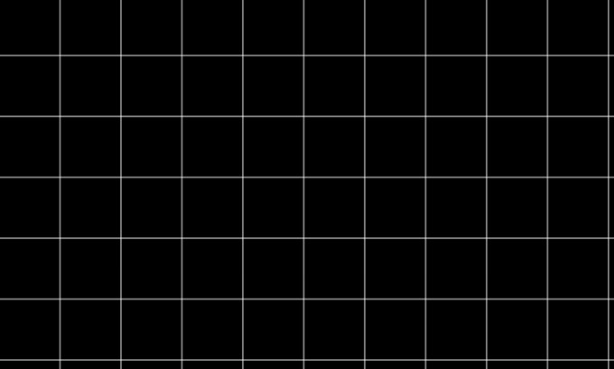
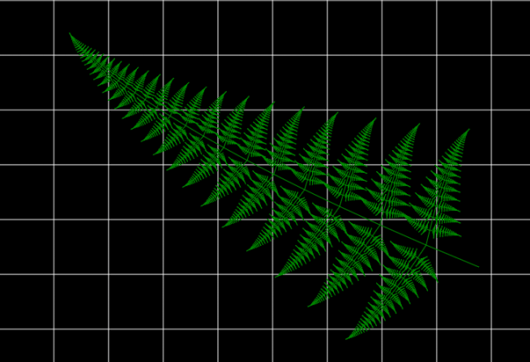
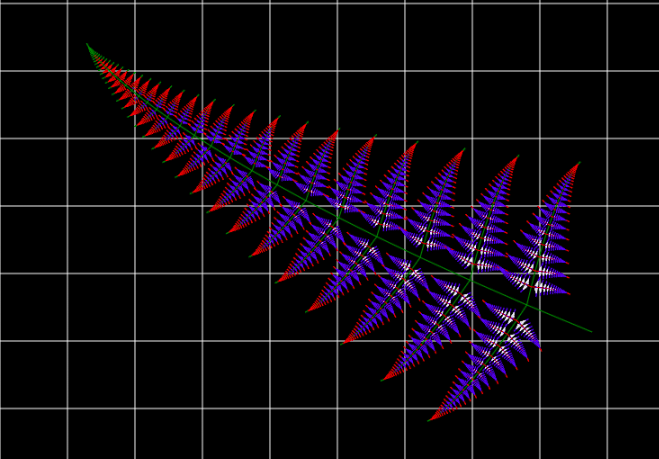
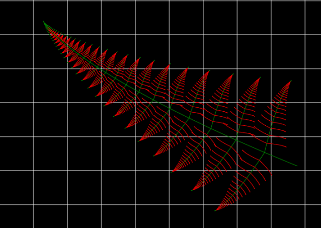

# Папоротник Барнсли на JavaScript



## Необходимый дисклеймер:
Сразу хочу предупредить, что здесь не будет какой-либо глубокой математики, максимум подбор коэффициентов.

Доброе утро!

На днях решил разобрать бардак на старом жестком диске и наткнулся на папку с различными программками написанными на C++ ещё во время учёбы в университете (а какой язык ещё изучать в универе?). И заинтересовал меня файл с именем "Папоротник". Как можно догадаться это оказалось простое приложение для отрисовки фрактала "Папоротник Барнсли". Подробней о том, что же это такое можно почитать хотя бы на [вики](https://ru.wikipedia.org/wiki/%D0%9F%D0%B0%D0%BF%D0%BE%D1%80%D0%BE%D1%82%D0%BD%D0%B8%D0%BA_%D0%91%D0%B0%D1%80%D0%BD%D1%81%D0%BB%D0%B8 "Папоротник Барнсли"). Вспомнив, что давно хотел попробовать порисовать в `Canvas` на JavaScript я решил переписать код и немного поиграться с цветами и коэффициентами. Оставляю любознательным читателям возможность самостоятельно разбираться со всякими афинными преобразованиями и прочей математикой. Итак, за дело!

Для начала создадим полотно на котором и будем рисовать наш папоротник. Подключим index.js, где будем писать непосредственно код:

``` html
<body style="margin: 0; padding: 0;">
    <Canvas></Canvas>
    <script src="./index.js"></script>
</body>
```

Получим наш `canvas` и зальём фон чёрным цветом. По моей задумке так будет выглядеть достаточно эффектно: зелёное на чёрном.

```javascript
const canvas = document.getElementsByTagName('canvas')[0];
const ctx = canvas.getContext('2d');
canvas.width = window.innerWidth;
canvas.height = window.innerHeight;
ctx.fillRect(0, 0, window.innerWidth, window.innerHeight);
ctx.strokeStyle = 'green';
```

Теперь напишем функцию, которая будет считать для нас параметры отрисовки основываясь на переданных коэффициентах:

```javascript
function config(alpha, beta, k, k1) {
    return {
        A: Math.cos(alpha * Math.PI / 180),
        B: Math.sin(alpha * Math.PI / 180),
        C: 1 - k,
        D: k,
        E: 1 - k1,
        F: k1,
        G: Math.cos(beta * Math.PI / 180),
        H: Math.sin(beta * Math.PI / 180)
    };
};
```

Сразу выполним расчёты:

```javascript
    let alpha = 1;
    let beta = 80;
    let k = 0.12;
    let k1 = 0.3;
    let settings = config(alpha, beta, k, k1);
```

Думаю, что ещё будет полезно нарисовать какую-нибудь сетку. Это поможет разобраться с координатами тем, кто этого захочет:

```javascript
function drawGrids(canvas, step) {
    let ctx = canvas.getContext('2d');
    let maxX = canvas.width;
    let maxY = canvas.height;
    ctx.strokeStyle = 'white';
    ctx.beginPath();
    for (let startX = 0; startX < maxX; startX += step) {
        ctx.moveTo(startX, 0);
        ctx.lineTo(startX, maxY);
    }
    for (let startY = 0; startY < maxY; startY += step) {
        ctx.moveTo(0, startY);
        ctx.lineTo(maxX, startY);
    }
    ctx.stroke();
};

drawGrids(canvas, gridStep);
```

Ничего необычного, просто сетка на чёрном фоне:



Ну и теперь осталось самое главное - рекурсивно отрисовать наш папоротник:

```javascript
function draw(ctx, x1, y1, x2, y2, num) {
    // останавливаемся, если надо рисовать меньше пикселя
    if ((x1 - x2) * (x1 - x2) + (y1 - y2) * (y1 - y2) > 1) {
        let x3 = (x2 - x1) * settings.A - (y2 - y1) * settings.B + x1;
        let y3 = (x2 - x1) * settings.B + (y2 - y1) * settings.A + y1;
        let x4 = x1 * settings.C + x3 * settings.D;
        let y4 = y1 * settings.C + y3 * settings.D;
        let x5 = x4 * settings.E + x3 * settings.F;
        let y5 = y4 * settings.E + y3 * settings.F;
        let x6 = (x5 - x4) * settings.G - (y5 - y4) * settings.H + x4;
        let y6 = (x5 - x4) * settings.H + (y5 - y4) * settings.G + y4;
        let x7 = (x5 - x4) * settings.G + (y5 - y4) * settings.H + x4;
        let y7 = -(x5 - x4) * settings.H + (y5 - y4) * settings.G + y4;
        // посчитали новые координаты, теперь рисуем
        ctx.beginPath();
        ctx.moveTo(x1, y1);
        ctx.lineTo(x4, y4);
        ctx.stroke();
        // рекурсивно рисуем дальше
        draw(ctx, x4, y4, x3, y3, num);
        draw(ctx, x4, y4, x6, y6, num + 1);
        draw(ctx, x4, y4, x7, y7, num + 1);
    }
};

draw(ctx, canvas.width - 100, canvas.height / 2 + 100, 50, 200, 0);
```

Вуаля!


Теперь всё готово. Но осталось ещё пространство для различных экспериментов. Например поиграемся с цветом:

```javascript
//    ctx.strokeStyle = 'green';
const colors = [
    'green',
    'green',
    'red',
    'blue',
    'white',
    'red'
];
```

И в `draw`:

```javascript
    ctx.beginPath();
    ctx.strokeStyle = colors[num] || 'green';
    ctx.moveTo(x1, y1);
    ctx.lineTo(x4, y4);
    ctx.stroke();
```



Добавив условие на глубину вложения можно рисовать только "каркас" папоротника:
```javascript
if (num == 3 ) return;
```



## Заключение
На этом всё. Оставляю то, что получилось на [codepen](https://codepen.io/kasimoka/pen/xzgmQy "Папоротник на codepen") для желающих поиграться. И сразу несколько подсказок:
`alpha` - угол изгиба папоротника.
`beta` - угол роста "листочков" от ствола.
`k` - пышность папоротника (при увеличении редеет, при уменьшении становится пышнее).
`k1` - коэффициент уменьшения длины штрихов из которых состоит папоротник.